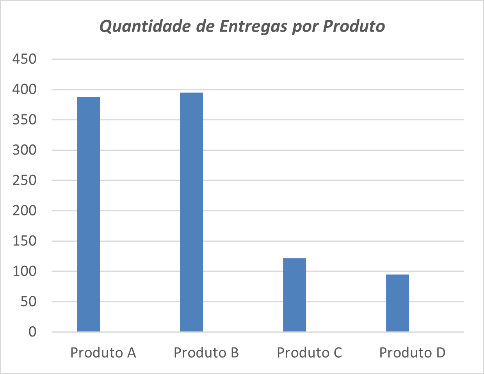
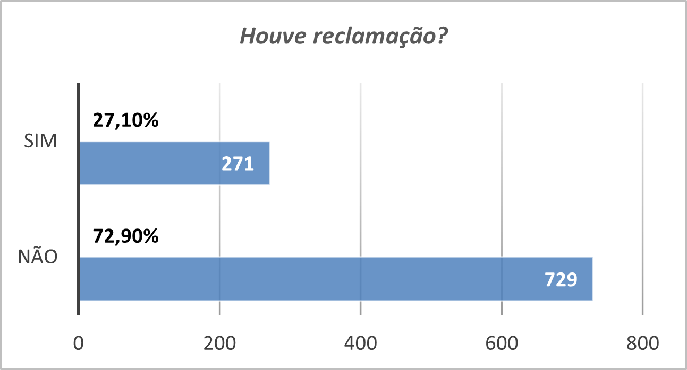
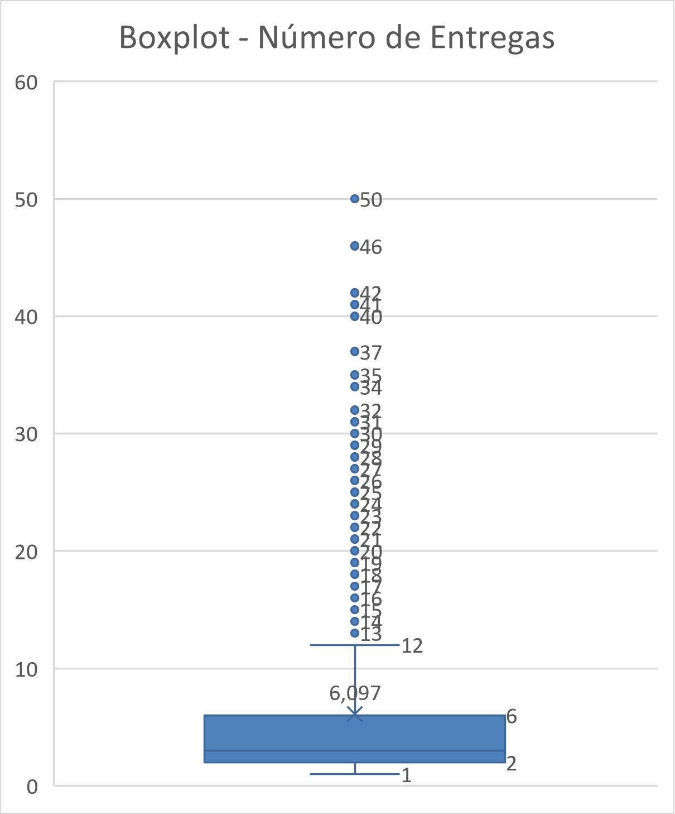
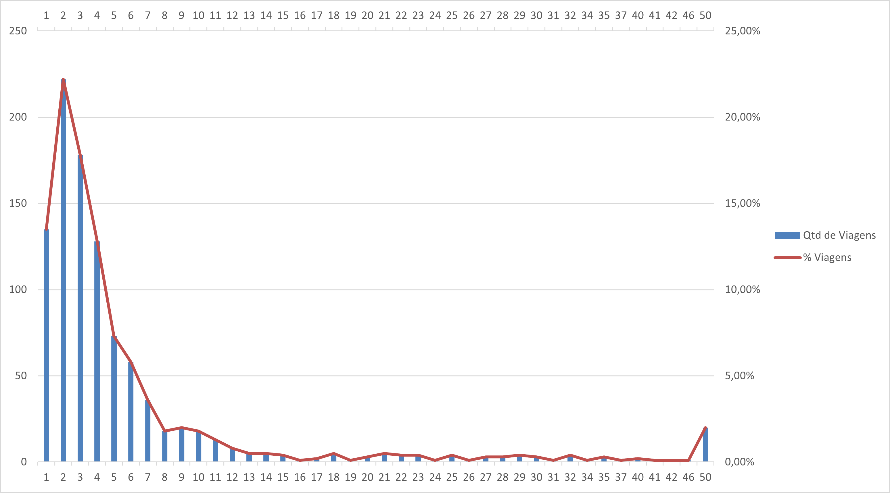
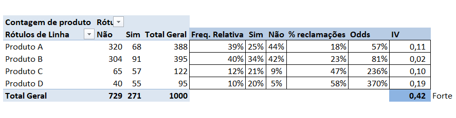
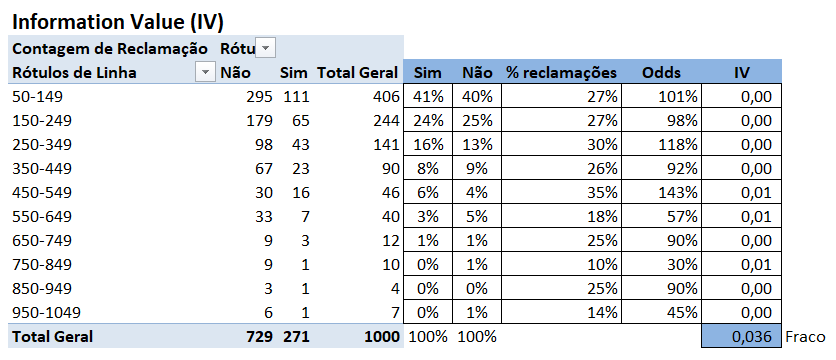
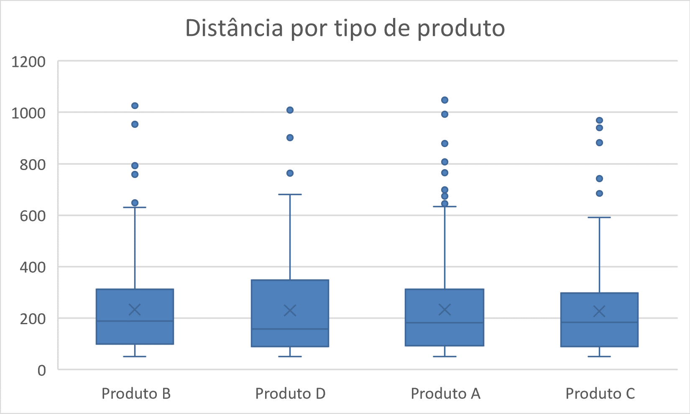
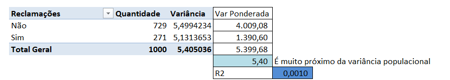

# Análise Exploratória de Dados Logísticos

## Objetivo

Realizar uma análise exploratória da base de operações logísticas, com o objetivo de compreender padrões operacionais, variabilidade das entregas e identificar possíveis fatores associados à performance e à ocorrência de reclamações.

---

## Base de Dados

Base contendo 1.000 viagens com informações sobre:

- Produto transportado
- Tipo de caminhão
- Distância percorrida
- Número de entregas
- Número de paradas do motorista
- Duração da viagem
- Indicador de reclamação

---

## Metodologia

A análise foi conduzida utilizando Excel, com aplicação de:

- Estatísticas descritivas
- Análise de dispersão e correlação
- Boxplots e análise de distribuição
- Segmentação por categorias
- Information Value (IV)
- Coeficiente de determinação (R²)

---

## Principais Achados

### 🔹 Perfil Operacional
- A maioria das viagens ocorre em 1 dia.
- 75% das viagens realizam até 6 entregas.
- Produtos A e B concentram a maior parte do volume.
- Caminhões de tanque médio são os mais utilizados.

### 🔹 Relações Operacionais
- Forte correlação (0,73) entre número de entregas e distância percorrida.
- Alta variabilidade na distância e no número de paradas.

### 🔹 Fatores Associados a Reclamações
- O tipo de produto apresentou forte poder discriminatório (IV elevado).
- Distância percorrida e número de paradas apresentaram baixo poder explicativo.

## Execução da Análise
---
# 1. Verificação de Consistência

Foram realizadas validações de:

- Campos nulos (0 ocorrências)
- Duplicidades em chave única (0 ocorrências)
- Intervalos numéricos válidos
- Padronização de variáveis categóricas

---

# 2. Estatísticas Descritivas

Principais métricas:

- Média de entregas: **6,10**
- Mediana de entregas: **3**
- Média de distância: **232 km**
- Média de paradas: **4,79**
- Reclamações: **27% das viagens**

### Distribuição de Produtos

### Reclamações

---

# 3. Número de Entregas

## Boxplot – Entregas

 75% das viagens realizam até 6 entregas  
 53% realizam até 3 entregas  

---

# 4. Entregas x Distância

Foi identificada correlação positiva forte entre número de entregas e distância percorrida.

**Correlação (r) = 0,73**

Interpretação:
O número de entregas é um dos principais determinantes da distância percorrida.

---

# 5. Produto x Reclamação

## Information Value (IV)

**IV = 0,42 → Forte poder discriminatório**

Produto D apresentou maior taxa de reclamação (58%).

Conclusão:
O tipo de produto é o principal driver identificado na ocorrência de reclamações.

---

# 6. Distância x Reclamação

## Information Value (IV)

**IV = 0,036 → Poder fraco**

As distribuições de “Sim” e “Não” são semelhantes ao longo das faixas.

Conclusão:
A distância percorrida não discrimina adequadamente viagens com e sem reclamação.

---

# 7. Distância x Produto

Não há diferença estrutural relevante entre produtos em relação à distância.

---

# 8. Paradas x Reclamação

Coeficiente de determinação:

**R² = 0,001**

Conclusão:
Não foi identificada associação estatisticamente relevante entre quantidade de paradas e ocorrência de reclamação.

---

# Ranking de Importância das Variáveis

| Variável | Métrica | Força |
|----------|----------|--------|
| Produto | IV = 0,42 | Forte |
| Entregas x Distância | r = 0,73 | Forte estrutural |
| Distância | IV = 0,036 | Fraco |
| Paradas | R² = 0,001 | Nulo |

---

# Conclusões Consolidadas

- Reclamações estão mais associadas ao tipo de produto do que a fatores operacionais.
- Variáveis logísticas como distância e paradas não apresentaram poder explicativo relevante.
- Existe relação estrutural consistente entre número de entregas e distância percorrida.

---

## Ferramentas Utilizadas

- Excel
- Tabelas Dinâmicas
- Fórmulas Avançadas
- Análise Estatística Descritiva

---

## Possíveis Evoluções

- Modelagem preditiva com regressão logística
- Automatização com Power Query
- Dashboard interativo em Power BI
- Implementação em Python (Pandas)
